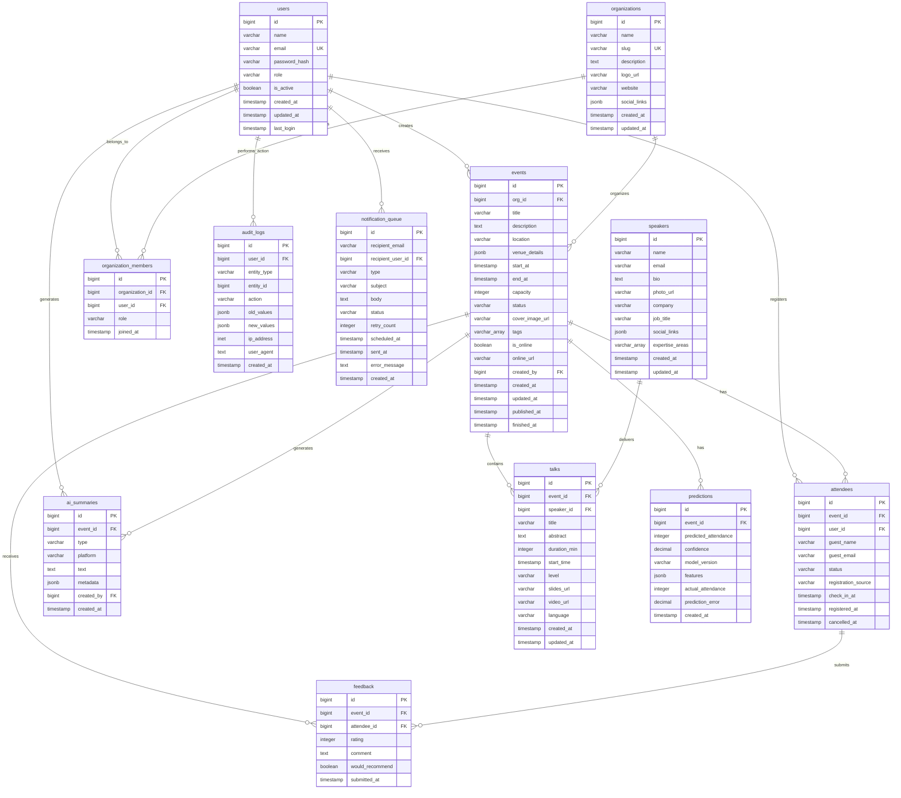

# PredictifyLabs - Database Schema

## Descripción General

Base de datos PostgreSQL diseñada para un sistema de gestión de meetups y eventos con capacidades de inteligencia artificial para predicciones de asistencia y generación de contenido.

[Script SQL para crear la base de datos](https://drive.google.com/file/d/11NldP1wAa1Ba7Q_S4yEZyy6pmqEj-pgO/view?usp=sharing)


[Diagrama Entidad-Relación](https://drive.google.com/file/d/1h2wEUBdC4fqWASFXthrFmloprC1us2YZ/view?usp=sharing)

## Arquitectura de Datos

### Tecnología

- **Motor**: PostgreSQL 12+
- **Extensiones requeridas**:
  - `uuid-ossp`: Generación de UUIDs
  - `pg_trgm`: Búsquedas de texto eficientes con similitud trigram

---

## Modelo de Datos

### Diagrama Entidad-Relación



---

## Entidades Principales

### 1. **users**

Almacena usuarios del sistema con tres roles principales.

**Campos clave**:

- `role`: Enum (`ROLE_USER`, `ROLE_ORGANIZER`, `ROLE_ADMIN`)
- `is_active`: Control de estado de cuenta
- `last_login`: Auditoría de sesiones

**Índices**:

- `idx_users_email`: Búsqueda por correo
- `idx_users_role`: Filtrado por rol
- `idx_users_active`: Usuarios activos

**Decisión arquitectónica**: El hash de contraseña se almacena con BCrypt (indicado por prefijo `$2a$10$`). La autenticación JWT se maneja en capa de aplicación.

---

### 2. **organizations**

Entidades que organizan eventos (comunidades, empresas).

**Campos clave**:

- `slug`: Identificador amigable para URLs
- `social_links`: JSONB para flexibilidad en redes sociales

**Índices**:

- `idx_organizations_slug`: Acceso directo por slug
- `idx_organizations_name`: Búsqueda trigram para autocompletado

---

### 3. **events**

Núcleo del sistema. Representa meetups o eventos.

**Estados posibles**:

- `DRAFT`: Borrador no publicado
- `PUBLISHED`: Visible públicamente
- `CANCELLED`: Cancelado
- `FINISHED`: Finalizado

**Campos clave**:

- `venue_details`: JSONB con dirección, mapa, estacionamiento
- `tags`: Array para categorización multi-dimensional
- `is_online`: Flag para eventos virtuales
- `capacity`: Límite de asistentes

**Índices estratégicos**:

- `idx_events_start_at`: Ordenamiento cronológico descendente
- `idx_events_tags`: Índice GIN para búsqueda en arrays
- `idx_events_title`: Búsqueda fuzzy con trigram

**Constraints**:

- `ON DELETE CASCADE` en `org_id`: Eliminar eventos al borrar organización
- `ON DELETE RESTRICT` en `created_by`: Prevenir borrado de usuario creador

---

### 4. **speakers**

Catálogo de ponentes reutilizables entre eventos.

**Campos clave**:

- `expertise_areas`: Array de especialidades
- `social_links`: JSONB para LinkedIn, Twitter, GitHub, etc.

**Índices**:

- `idx_speakers_expertise`: GIN para búsqueda por área

---

### 5. **talks**

Charlas individuales dentro de un evento.

**Campos clave**:

- `level`: Enum (`BEGINNER`, `INTERMEDIATE`, `ADVANCED`)
- `duration_min`: Duración en minutos
- `slides_url`, `video_url`: Enlaces a material

**Relaciones**:

- Cascada en `event_id`: Borrar charlas al eliminar evento
- Restricción en `speaker_id`: No borrar speakers con charlas asociadas

---

### 6. **attendees**

Registro de asistencia a eventos.

**Estados**:

- `REGISTERED`: Pre-registro inicial
- `CONFIRMED`: Confirmación explícita
- `ATTENDED`: Check-in realizado
- `NO_SHOW`: No asistió
- `CANCELLED`: Canceló registro

**Diseño dual de usuarios**:

```sql
CONSTRAINT check_user_or_guest CHECK (
    user_id IS NOT NULL OR
    (guest_name IS NOT NULL AND guest_email IS NOT NULL)
)
```

Permite registro tanto de usuarios autenticados como invitados anónimos.

**Constraint de unicidad**:

```sql
CONSTRAINT unique_event_user UNIQUE(event_id, user_id)
```

Previene registros duplicados.

---

### 7. **ai_summaries**

Contenido generado por IA (GPT, Claude, etc.).

**Tipos soportados**:

- `EVENT_DESCRIPTION`: Descripciones automáticas
- `SOCIAL_POST`: Posts para redes sociales
- `POST_EVENT_SUMMARY`: Resúmenes post-evento
- `SPEAKER_BIO`: Biografías generadas

**Campo `metadata`**: JSONB con información del modelo:

```json
{
  "model_used": "gpt-4",
  "prompt_tokens": 150,
  "completion_tokens": 320,
  "temperature": 0.7
}
```

---

### 8. **predictions**

Predicciones de ML para asistencia a eventos.

**Campos clave**:

- `predicted_attendance`: Predicción del modelo
- `confidence`: Score de confianza [0-1]
- `features`: JSONB con features usados
- `actual_attendance`: Valor real (post-evento)
- `prediction_error`: Métrica de error

**Flujo**:

1. Pre-evento: Se genera predicción
2. Post-evento: Se actualiza `actual_attendance`
3. Se calcula `prediction_error` para reentrenamiento

---

### 9. **feedback**

Retroalimentación de asistentes.

**Campos**:

- `rating`: 1-5 estrellas
- `comment`: Texto libre
- `would_recommend`: Boolean para NPS

**Índices**:

- `idx_feedback_rating`: Agregaciones rápidas de ratings

---

### 10. **audit_logs**

Trazabilidad completa de acciones críticas.

**Campos**:

- `entity_type`: Tipo de entidad afectada
- `action`: CREATE, UPDATE, DELETE, PUBLISH, etc.
- `old_values`, `new_values`: JSONB con cambios
- `ip_address`: INET para geolocalización
- `user_agent`: Para análisis de uso

**Uso**: Compliance, debugging, análisis de comportamiento.

---

### 11. **notification_queue**

Cola de notificaciones con reintentos.

**Estados**:

- `PENDING`: Pendiente de envío
- `SENT`: Enviado exitosamente
- `FAILED`: Falló después de reintentos

**Campos**:

- `retry_count`: Contador de reintentos
- `scheduled_at`: Permite notificaciones programadas
- `error_message`: Logging de fallos

---

### 12. **organization_members**

Relación muchos-a-muchos entre usuarios y organizaciones.

**Roles**:

- `OWNER`: Propietario
- `ADMIN`: Administrador
- `MEMBER`: Miembro

**Constraint**:

```sql
CONSTRAINT unique_org_user UNIQUE(organization_id, user_id)
```

---

## Características Avanzadas

### Triggers Automáticos

**Actualización de `updated_at`**:

```sql
CREATE TRIGGER update_events_updated_at
BEFORE UPDATE ON events
FOR EACH ROW EXECUTE FUNCTION update_updated_at_column();
```

Aplicado en: `users`, `organizations`, `events`, `speakers`, `talks`.

---

### Vistas Materializadas

#### **events_with_stats**

Agregación en tiempo real de métricas de eventos:

- Conteo de registrados
- Conteo de asistentes reales
- Número de charlas
- Rating promedio
- Última predicción de ML

#### **upcoming_events**

Eventos publicados y futuros ordenados cronológicamente.

---

## Índices Estratégicos

### Índices GIN

Para búsquedas en arrays y texto:

```sql
CREATE INDEX idx_events_tags ON events USING gin(tags);
CREATE INDEX idx_events_title ON events USING gin(title gin_trgm_ops);
```

### Índices B-Tree

Para claves foráneas y ordenamiento:

```sql
CREATE INDEX idx_events_start_at ON events(start_at DESC);
CREATE INDEX idx_audit_logs_created_at ON audit_logs(created_at DESC);
```

---

## Tipos de Datos Especializados

### JSONB

Usado para estructura flexible:

- `social_links`: Enlaces dinámicos a redes sociales
- `venue_details`: Información variable de locaciones
- `metadata`: Datos técnicos de IA/ML

### INET

Para direcciones IP en `audit_logs`.

### Arrays

Para colecciones:

- `tags`: Categorías múltiples
- `expertise_areas`: Múltiples especialidades

---

## Seed Data

Datos iniciales incluidos:

- 3 usuarios: Admin, Organizador, Usuario regular
- 2 organizaciones: BarranquillaJS, Python Barranquilla

**Nota**: Los hashes de contraseña son placeholders (`$2a$10$dummyhash`).

---

## Decisiones de Diseño

### 1. Soft Delete vs Hard Delete

Se usa **hard delete** con estrategias de cascade/restrict según caso:

- Cascade: `events` → `talks`, `attendees`
- Restrict: `users` (creadores), `speakers` (con charlas)
- Set Null: `audit_logs`, `feedback` (mantener histórico)

### 2. JSONB vs Tablas Normalizadas

JSONB para datos:

- De estructura variable (social links, venue details)
- De baja frecuencia de query (metadata de IA)
- Que no requieren joins

### 3. Enums como VARCHAR con CHECK

```sql
status VARCHAR(50) CHECK (status IN ('DRAFT', 'PUBLISHED', ...))
```

Preferido sobre enums nativos de PostgreSQL por flexibilidad en migraciones.

### 4. Timestamps Múltiples

Captura del ciclo de vida completo:

- `created_at`: Auditoría de creación
- `updated_at`: Última modificación
- `published_at`: Momento de publicación
- `finished_at`: Cierre real del evento

---

## Integración con Spring Boot

### Entidades JPA Recomendadas

```java
@Entity
@Table(name = "events")
public class Event {
    @Id
    @GeneratedValue(strategy = GenerationType.IDENTITY)
    private Long id;

    @ManyToOne(fetch = FetchType.LAZY)
    @JoinColumn(name = "org_id", nullable = false)
    private Organization organization;

    @Enumerated(EnumType.STRING)
    private EventStatus status;

    @Type(JsonBinaryType.class)
    @Column(columnDefinition = "jsonb")
    private Map<String, Object> venueDetails;

    @Column(columnDefinition = "varchar(100)[]")
    private String[] tags;

    // Getters, setters, builders
}
```

### Consideraciones Hibernate

1. **JSONB**: Usar `@Type(JsonBinaryType.class)` con Hibernate Types library
2. **Arrays**: Mapear como arrays nativos de Java o usar `@ElementCollection`
3. **Triggers**: Hibernate no interferirá con triggers de `updated_at`

---

## Consultas Comunes

### Eventos próximos con predicción

```sql
SELECT * FROM upcoming_events
WHERE prediction_confidence > 0.8
LIMIT 10;
```

### Asistencia real vs predicha

```sql
SELECT
    e.title,
    p.predicted_attendance,
    COUNT(a.id) FILTER (WHERE a.status = 'ATTENDED') as actual,
    p.prediction_error
FROM events e
JOIN predictions p ON e.id = p.event_id
LEFT JOIN attendees a ON e.id = a.event_id
WHERE e.status = 'FINISHED'
GROUP BY e.id, p.predicted_attendance, p.prediction_error;
```

### Speakers más activos

```sql
SELECT
    s.name,
    COUNT(t.id) as talks_count,
    AVG(f.rating) as avg_rating
FROM speakers s
JOIN talks t ON s.id = t.speaker_id
JOIN feedback f ON t.event_id = f.event_id
GROUP BY s.id
ORDER BY talks_count DESC;
```

---

## Migraciones

### Herramientas recomendadas

- **Flyway**: Migraciones versionadas con SQL puro
- **Liquibase**: Mayor control con XML/YAML

### Estrategia

1. Script inicial: `V1__initial_schema.sql`
2. Migraciones incrementales: `V2__add_column_xyz.sql`
3. Rollback scripts: `U2__rollback_xyz.sql`

---

## Seguridad

### Row Level Security (RLS)

Considerar políticas para multi-tenancy:

```sql
ALTER TABLE events ENABLE ROW LEVEL SECURITY;

CREATE POLICY org_isolation ON events
FOR ALL TO app_user
USING (org_id IN (
    SELECT organization_id
    FROM organization_members
    WHERE user_id = current_user_id()
));
```

### Encriptación

- Contraseñas: BCrypt en capa de aplicación
- Datos sensibles: PostgreSQL pgcrypto para PII

---

## Performance

### Monitoreo

```sql
-- Índices no usados
SELECT schemaname, tablename, indexname
FROM pg_stat_user_indexes
WHERE idx_scan = 0;

-- Queries lentas
SELECT query, mean_exec_time
FROM pg_stat_statements
ORDER BY mean_exec_time DESC
LIMIT 10;
```

### Optimizaciones futuras

- Particionamiento de `audit_logs` por fecha
- Materializar `events_with_stats` para eventos grandes
- Índices parciales para queries específicos

---

## Licencia

Este schema es parte del proyecto PredictifyLabs.
