# PredictifyLabs - Database Schema

## Descripción General

Base de datos PostgreSQL diseñada para un sistema de gestión de meetups y eventos con capacidades de inteligencia artificial para predicciones de asistencia y generación de contenido, con soporte para:

- Autenticación JWT y OAuth (Google/GitHub)
- Organizaciones y eventos
- Ponentes, charlas y asistentes
- IA generativa (resúmenes)
- Predicciones ML
- Sistema de notificaciones

[Script SQL para crear la base de datos](https://drive.google.com/file/d/1UIcOXR0BLbHyE9PSLc1cuGbkJAr-JAix/view?usp=sharing)

[Diagrama Entidad-Relación](https://drive.google.com/file/d/1IKo1ZRnze0cejs33RePKA9Wty2EK_g_a/view?usp=sharing)

## Arquitectura de Datos

### Tecnología

- **Motor**: PostgreSQL 18
- **Extensiones requeridas**:
  - `uuid-ossp`: Generación de UUIDs
  - `pg_trgm`: Búsquedas de texto eficientes con similitud trigram

---

## Modelo de Datos

### Diagrama Entidad-Relación

```mermaid
erDiagram
    users ||--o{ tokens : "has"
    users ||--o{ organization_members : "belongs_to"
    users ||--o{ events : "creates"
    users ||--o{ attendees : "registers_as"
    users ||--o{ ai_summaries : "generates"
    users ||--o{ audit_logs : "performs"
    users ||--o{ notification_queue : "receives"

    organizations ||--o{ organization_members : "has_members"
    organizations ||--o{ events : "organizes"

    events ||--o{ talks : "contains"
    events ||--o{ attendees : "has_registrations"
    events ||--o{ ai_summaries : "generates_content"
    events ||--o{ predictions : "has_predictions"
    events ||--o{ feedback : "receives_feedback"

    speakers ||--o{ talks : "delivers"

    attendees ||--o{ feedback : "submits"

    users {
        SERIAL id PK
        VARCHAR name
        VARCHAR email UK "Unique constraint"
        VARCHAR password_hash "Nullable para OAuth"
        VARCHAR role "CHECK: ROLE_USER, ROLE_ORGANIZER, ROLE_ADMIN"
        VARCHAR auth_provider "DEFAULT: LOCAL | GOOGLE | GITHUB"
        BOOLEAN is_active "DEFAULT: true"
        TIMESTAMP last_login
        TIMESTAMP created_at
        TIMESTAMP updated_at "Auto-trigger"
    }

    tokens {
        SERIAL id PK
        VARCHAR token UK "SHA-256 hash del refresh token"
        VARCHAR token_type "DEFAULT: BEARER"
        BOOLEAN revoked "DEFAULT: false"
        BOOLEAN expired "DEFAULT: false"
        BIGINT user_id FK
        TIMESTAMP created_at
    }

    organizations {
        SERIAL id PK
        VARCHAR name
        VARCHAR slug UK "URL-friendly identifier"
        TEXT description
        VARCHAR logo_url
        VARCHAR website
        JSONB social_links "Flexible: twitter, linkedin, etc"
        TIMESTAMP created_at
        TIMESTAMP updated_at "Auto-trigger"
    }

    organization_members {
        SERIAL id PK
        BIGINT organization_id FK
        BIGINT user_id FK
        VARCHAR role "CHECK: OWNER, ADMIN, MEMBER"
        TIMESTAMP joined_at
        UNIQUE organization_id_user_id "Composite unique constraint"
    }

    events {
        SERIAL id PK
        BIGINT org_id FK
        VARCHAR title
        TEXT description
        VARCHAR location
        JSONB venue_details "Maps, parking, instructions"
        TIMESTAMP start_at
        TIMESTAMP end_at
        INTEGER capacity
        VARCHAR status "CHECK: DRAFT, PUBLISHED, CANCELLED, FINISHED"
        VARCHAR cover_image_url
        VARCHAR_ARRAY tags "PostgreSQL Array"
        BOOLEAN is_online "DEFAULT: false"
        VARCHAR online_url
        BIGINT created_by FK
        TIMESTAMP created_at
        TIMESTAMP updated_at "Auto-trigger"
        TIMESTAMP published_at
        TIMESTAMP finished_at
    }

    speakers {
        SERIAL id PK
        VARCHAR name
        VARCHAR email
        TEXT bio
        VARCHAR photo_url
        VARCHAR company
        VARCHAR job_title
        JSONB social_links
        VARCHAR_ARRAY expertise_areas "PostgreSQL Array"
        TIMESTAMP created_at
        TIMESTAMP updated_at "Auto-trigger"
    }

    talks {
        SERIAL id PK
        BIGINT event_id FK
        BIGINT speaker_id FK
        VARCHAR title
        TEXT abstract
        INTEGER duration_min
        TIMESTAMP start_time
        VARCHAR level "CHECK: BEGINNER, INTERMEDIATE, ADVANCED"
        VARCHAR slides_url
        VARCHAR video_url
        VARCHAR language "DEFAULT: ES"
        TIMESTAMP created_at
        TIMESTAMP updated_at "Auto-trigger"
    }

    attendees {
        SERIAL id PK
        BIGINT event_id FK
        BIGINT user_id FK "Nullable para invitados"
        VARCHAR guest_name "Para usuarios sin cuenta"
        VARCHAR guest_email "Para usuarios sin cuenta"
        VARCHAR status "CHECK: REGISTERED, CONFIRMED, ATTENDED, NO_SHOW, CANCELLED"
        VARCHAR registration_source "web, mobile, n8n, eventbrite"
        TIMESTAMP check_in_at
        TIMESTAMP registered_at
        TIMESTAMP cancelled_at
        UNIQUE event_id_user_id "Composite unique constraint"
        CHECK check_user_or_guest "user_id OR (guest_name AND guest_email)"
    }

    ai_summaries {
        SERIAL id PK
        BIGINT event_id FK
        VARCHAR type "CHECK: EVENT_DESCRIPTION, SOCIAL_POST, POST_EVENT_SUMMARY, SPEAKER_BIO"
        VARCHAR platform "Twitter, LinkedIn, Email"
        TEXT text
        JSONB metadata "Tokens, model, temperature"
        BIGINT created_by FK
        TIMESTAMP created_at
    }

    predictions {
        SERIAL id PK
        BIGINT event_id FK
        INTEGER predicted_attendance
        DECIMAL confidence "0.0000 to 1.0000"
        VARCHAR model_version
        JSONB features "ML input features"
        INTEGER actual_attendance "Post-event"
        DECIMAL prediction_error
        TIMESTAMP created_at
    }

    feedback {
        SERIAL id PK
        BIGINT event_id FK
        BIGINT attendee_id FK
        INTEGER rating "CHECK: 1-5"
        TEXT comment
        BOOLEAN would_recommend
        TIMESTAMP submitted_at
    }

    audit_logs {
        SERIAL id PK
        BIGINT user_id FK
        VARCHAR entity_type
        BIGINT entity_id
        VARCHAR action "CREATE, UPDATE, DELETE"
        JSONB old_values
        JSONB new_values
        INET ip_address
        TEXT user_agent
        TIMESTAMP created_at
    }

    notification_queue {
        SERIAL id PK
        VARCHAR recipient_email
        BIGINT recipient_user_id FK
        VARCHAR type "EMAIL_CONFIRMATION, REMINDER, etc"
        VARCHAR subject
        TEXT body
        VARCHAR status "DEFAULT: PENDING"
        INTEGER retry_count "DEFAULT: 0"
        TIMESTAMP scheduled_at
        TIMESTAMP sent_at
        TEXT error_message
        TIMESTAMP created_at
    }
```



---

## Entidades del Sistema

### 1. Users

**Características principales:**

- Soporte para autenticación local (email/password) y OAuth (Google/GitHub)
- Sistema de roles jerárquico (USER, ORGANIZER, ADMIN)
- Password nullable para usuarios OAuth
- Control de estado activo/inactivo
- Auditoría de último login

```sql
CREATE TABLE users (
    id SERIAL PRIMARY KEY,
    name VARCHAR(150) NOT NULL,
    email VARCHAR(255) UNIQUE NOT NULL,
    password_hash VARCHAR(255), -- Nullable para usuarios de Google/GitHub
    role VARCHAR(50) NOT NULL CHECK (role IN ('ROLE_USER', 'ROLE_ORGANIZER', 'ROLE_ADMIN')),
    auth_provider VARCHAR(50) DEFAULT 'LOCAL', -- LOCAL, GOOGLE, GITHUB
    is_active BOOLEAN DEFAULT TRUE,
    last_login TIMESTAMP,
    created_at TIMESTAMP DEFAULT now(),
    updated_at TIMESTAMP DEFAULT now()
);

CREATE INDEX idx_users_email ON users(email);
```

**Decisiones de diseño:**

- Email como identificador único natural
- `auth_provider` permite estrategia de autenticación híbrida
- Índice en email para login rápido

---

### 2. Tokens

**Características principales:**

- Almacenamiento de refresh tokens JWT
- Control de estado (revocado/expirado)
- Vinculación directa con usuario
- Cascade delete para limpieza automática

```sql
CREATE TABLE tokens (
  id SERIAL PRIMARY KEY,
  token VARCHAR(255) UNIQUE NOT NULL,
  token_type VARCHAR(50) DEFAULT 'BEARER',
  revoked BOOLEAN DEFAULT FALSE,
  expired BOOLEAN DEFAULT FALSE,
  user_id BIGINT REFERENCES users(id) ON DELETE CASCADE,
  created_at TIMESTAMP DEFAULT now()
);
```

**Decisiones de diseño:**

- Token único garantiza no duplicación
- Estados booleanos permiten invalidación sin DELETE
- Cascade delete mantiene integridad al eliminar usuarios

---

### 3. Organizations

**Características principales:**

- Entidad multitenancy para comunidades/empresas
- Slug único para URLs amigables
- JSONB para redes sociales flexibles
- Campos opcionales de branding (logo, website)

```sql
CREATE TABLE organizations (
    id SERIAL PRIMARY KEY,
    name VARCHAR(255) NOT NULL,
    slug VARCHAR(100) UNIQUE NOT NULL,
    description TEXT,
    logo_url VARCHAR(255),
    website VARCHAR(255),
    social_links JSONB, -- Flexible para redes sociales
    created_at TIMESTAMP DEFAULT now(),
    updated_at TIMESTAMP DEFAULT now()
);

CREATE TRIGGER update_orgs_modtime BEFORE UPDATE ON organizations
FOR EACH ROW EXECUTE FUNCTION update_updated_at_column();
```

**Decisiones de diseño:**

- Slug único permite routing `/org/{slug}`
- JSONB evita columnas fijas para cada red social
- Trigger automático para `updated_at`

---

### 4. Organization Members

**Características principales:**

- Relación muchos a muchos entre Users y Organizations
- Sistema de roles interno (OWNER, ADMIN, MEMBER)
- Constraint de unicidad compuesto
- Auditoría de fecha de ingreso

```sql
CREATE TABLE organization_members (
    id SERIAL PRIMARY KEY,
    organization_id BIGINT REFERENCES organizations(id) ON DELETE CASCADE,
    user_id BIGINT REFERENCES users(id) ON DELETE CASCADE,
    role VARCHAR(50) CHECK (role IN ('OWNER', 'ADMIN', 'MEMBER')),
    joined_at TIMESTAMP DEFAULT now(),
    CONSTRAINT unique_org_user UNIQUE(organization_id, user_id)
);
```

**Decisiones de diseño:**

- Tabla intermedia con datos adicionales (role, joined_at)
- Cascade delete en ambas FKs para limpieza automática
- Constraint unique compuesto previene membresías duplicadas

---

### 5. Events

**Características principales:**

- Núcleo del sistema de gestión de meetups
- Soporte para eventos presenciales y online
- Estado de ciclo de vida (DRAFT → PUBLISHED → FINISHED/CANCELLED)
- JSONB para detalles de venue flexibles
- Arrays nativos de PostgreSQL para tags
- Capacidad limitada con validación

```sql
CREATE TABLE events (
    id SERIAL PRIMARY KEY,
    org_id BIGINT REFERENCES organizations(id) ON DELETE CASCADE,
    title VARCHAR(255) NOT NULL,
    description TEXT,
    location VARCHAR(255),
    venue_details JSONB, -- Mapa, dirección exacta, instrucciones
    start_at TIMESTAMP NOT NULL,
    end_at TIMESTAMP NOT NULL,
    capacity INTEGER,
    status VARCHAR(50) CHECK (status IN ('DRAFT', 'PUBLISHED', 'CANCELLED', 'FINISHED')),
    cover_image_url VARCHAR(255),
    tags VARCHAR(100)[], -- Array de etiquetas
    is_online BOOLEAN DEFAULT FALSE,
    online_url VARCHAR(255),
    created_by BIGINT REFERENCES users(id) ON DELETE RESTRICT,
    created_at TIMESTAMP DEFAULT now(),
    updated_at TIMESTAMP DEFAULT now(),
    published_at TIMESTAMP,
    finished_at TIMESTAMP
);

CREATE INDEX idx_events_start_at ON events(start_at DESC);
CREATE INDEX idx_events_tags ON events USING gin(tags);
CREATE INDEX idx_events_title ON events USING gin(title gin_trgm_ops);

CREATE TRIGGER update_events_modtime BEFORE UPDATE ON events
FOR EACH ROW EXECUTE FUNCTION update_updated_at_column();
```

**Decisiones de diseño:**

- RESTRICT en `created_by` para no perder historial de creador
- Índice GIN en tags para búsquedas eficientes `WHERE 'java' = ANY(tags)`
- Índice trigrama en title para búsqueda fuzzy
- Timestamps de estado (published_at, finished_at) para métricas

---

### 6. Speakers

**Características principales:**

- Entidad independiente reutilizable entre eventos
- JSONB para redes sociales
- Arrays para áreas de expertise
- Información profesional completa

```sql
CREATE TABLE speakers (
    id SERIAL PRIMARY KEY,
    name VARCHAR(255) NOT NULL,
    email VARCHAR(255),
    bio TEXT,
    photo_url VARCHAR(255),
    company VARCHAR(150),
    job_title VARCHAR(150),
    social_links JSONB,
    expertise_areas VARCHAR(100)[],
    created_at TIMESTAMP DEFAULT now(),
    updated_at TIMESTAMP DEFAULT now()
);

CREATE TRIGGER update_speakers_modtime BEFORE UPDATE ON speakers
FOR EACH ROW EXECUTE FUNCTION update_updated_at_column();
```

**Decisiones de diseño:**

- Speaker no depende de User para permitir invitados externos
- Email opcional (speaker puede no tener cuenta)
- Expertise como array para filtrado y recomendaciones

---

### 7. Talks

**Características principales:**

- Charlas dentro de eventos con programación detallada
- Vinculación con speaker (RESTRICT para no perder historial)
- Niveles de dificultad para audiencia adecuada
- Recursos post-evento (slides, video)
- Soporte multiidioma

```sql
CREATE TABLE talks (
    id SERIAL PRIMARY KEY,
    event_id BIGINT REFERENCES events(id) ON DELETE CASCADE,
    speaker_id BIGINT REFERENCES speakers(id) ON DELETE RESTRICT,
    title VARCHAR(255) NOT NULL,
    abstract TEXT,
    duration_min INTEGER,
    start_time TIMESTAMP,
    level VARCHAR(50) CHECK (level IN ('BEGINNER', 'INTERMEDIATE', 'ADVANCED')),
    slides_url VARCHAR(255),
    video_url VARCHAR(255),
    language VARCHAR(10) DEFAULT 'ES',
    created_at TIMESTAMP DEFAULT now(),
    updated_at TIMESTAMP DEFAULT now()
);

CREATE TRIGGER update_talks_modtime BEFORE UPDATE ON talks
FOR EACH ROW EXECUTE FUNCTION update_updated_at_column();
```

**Decisiones de diseño:**

- Cascade en event (si evento se borra, sus charlas también)
- RESTRICT en speaker (mantener historial de ponencias)
- `duration_min` para cálculos de agenda
- URLs opcionales para contenido post-evento

---

### 8. Attendees

**Características principales:**

- Sistema híbrido: usuarios registrados + invitados guest
- Estados de ciclo de vida del asistente
- Check-in con timestamp
- Constraint de exclusión mutua (user XOR guest)
- Constraint unique compuesto para evitar duplicados

```sql
CREATE TABLE attendees (
    id SERIAL PRIMARY KEY,
    event_id BIGINT REFERENCES events(id) ON DELETE CASCADE,
    user_id BIGINT REFERENCES users(id),
    guest_name VARCHAR(150),
    guest_email VARCHAR(255),
    status VARCHAR(50) DEFAULT 'REGISTERED' CHECK (status IN ('REGISTERED', 'CONFIRMED', 'ATTENDED', 'NO_SHOW', 'CANCELLED')),
    registration_source VARCHAR(50),
    check_in_at TIMESTAMP,
    registered_at TIMESTAMP DEFAULT now(),
    cancelled_at TIMESTAMP,
    CONSTRAINT check_user_or_guest CHECK (
        user_id IS NOT NULL OR (guest_name IS NOT NULL AND guest_email IS NOT NULL)
    ),
    CONSTRAINT unique_event_user UNIQUE(event_id, user_id)
);

CREATE INDEX idx_attendees_event_user ON attendees(event_id, user_id);
```

**Decisiones de diseño:**

- Constraint CHECK garantiza integridad: o es user o es guest
- Unique en (event, user) evita registros duplicados
- `registration_source` para análisis de canales de adquisición
- Estados permiten workflows complejos (confirmación, check-in)

---

### 9. AI Summaries

**Características principales:**

- Contenido generado por IA asociado a eventos
- Tipos especializados por caso de uso
- JSONB metadata para trazabilidad del modelo
- Vinculación con usuario creador

```sql
CREATE TABLE ai_summaries (
    id SERIAL PRIMARY KEY,
    event_id BIGINT REFERENCES events(id) ON DELETE CASCADE,
    type VARCHAR(50) CHECK (type IN ('EVENT_DESCRIPTION', 'SOCIAL_POST', 'POST_EVENT_SUMMARY', 'SPEAKER_BIO')),
    platform VARCHAR(50), -- Twitter, LinkedIn, Email
    text TEXT NOT NULL,
    metadata JSONB, -- Tokens usados, modelo, temperatura
    created_by BIGINT REFERENCES users(id),
    created_at TIMESTAMP DEFAULT now()
);
```

**Decisiones de diseño:**

- Metadata JSONB permite almacenar parámetros del modelo sin schema fijo
- Type específico permite queries por propósito
- Platform opcional para contenido multiplataforma

---

### 10. Predictions

**Características principales:**

- Machine Learning predictions de asistencia
- Confidence score para evaluación
- Comparación predicción vs realidad
- JSONB features para reproducibilidad

```sql
CREATE TABLE predictions (
    id SERIAL PRIMARY KEY,
    event_id BIGINT REFERENCES events(id) ON DELETE CASCADE,
    predicted_attendance INTEGER,
    confidence DECIMAL(5,4), -- 0.0000 a 1.0000
    model_version VARCHAR(50),
    features JSONB, -- Inputs usados para predecir
    actual_attendance INTEGER, -- Se llena post-evento
    prediction_error DECIMAL(10,2),
    created_at TIMESTAMP DEFAULT now()
);
```

**Decisiones de diseño:**

- `actual_attendance` nullable hasta post-evento
- `features` JSONB permite trazabilidad de inputs del modelo
- `model_version` para A/B testing y evolución de modelos
- `prediction_error` calculado para métricas de accuracy

---

### 11. Feedback

**Características principales:**

- Opiniones de asistentes post-evento
- Rating numérico validado (1-5)
- Recomendación binaria
- Vinculación con attendee específico

```sql
CREATE TABLE feedback (
    id SERIAL PRIMARY KEY,
    event_id BIGINT REFERENCES events(id) ON DELETE CASCADE,
    attendee_id BIGINT REFERENCES attendees(id) ON DELETE CASCADE,
    rating INTEGER CHECK (rating >= 1 AND rating <= 5),
    comment TEXT,
    would_recommend BOOLEAN,
    submitted_at TIMESTAMP DEFAULT now()
);
```

**Decisiones de diseño:**

- FK a attendee (no a user) para capturar feedback de guests también
- Constraint CHECK garantiza rating válido
- `would_recommend` como métrica NPS simplificada

---

### 12. Audit Logs

**Características principales:**

- Trazabilidad completa de operaciones CRUD
- Snapshots de valores old/new en JSONB
- Captura de contexto (IP, user agent)
- Diseño genérico (entity_type + entity_id)

```sql
CREATE TABLE audit_logs (
    id SERIAL PRIMARY KEY,
    user_id BIGINT REFERENCES users(id),
    entity_type VARCHAR(50),
    entity_id BIGINT,
    action VARCHAR(50), -- CREATE, UPDATE, DELETE
    old_values JSONB,
    new_values JSONB,
    ip_address INET,
    user_agent TEXT,
    created_at TIMESTAMP DEFAULT now()
);
```

**Decisiones de diseño:**

- JSONB para old/new permite auditar cualquier entidad sin schema fijo
- INET nativo de PostgreSQL para IPs
- Tabla append-only (sin UPDATE/DELETE) para inmutabilidad

---

### 13. Notification Queue

**Características principales:**

- Cola de notificaciones para procesamiento asíncrono
- Sistema de reintentos con contador
- Estados de procesamiento
- Vinculación opcional con user registrado

```sql
CREATE TABLE notification_queue (
    id SERIAL PRIMARY KEY,
    recipient_email VARCHAR(255) NOT NULL,
    recipient_user_id BIGINT REFERENCES users(id),
    type VARCHAR(50), -- EMAIL_CONFIRMATION, REMINDER, ETC
    subject VARCHAR(255),
    body TEXT,
    status VARCHAR(20) DEFAULT 'PENDING',
    retry_count INTEGER DEFAULT 0,
    scheduled_at TIMESTAMP,
    sent_at TIMESTAMP,
    error_message TEXT,
    created_at TIMESTAMP DEFAULT now()
);
```

**Decisiones de diseño:**

- Email siempre presente (para guests sin user_id)
- `scheduled_at` permite envíos diferidos
- `retry_count` + `error_message` para debugging de fallos
- Status para idempotencia en workers

---

## Funciones y Triggers

### Función de Actualización Automática

```sql
CREATE OR REPLACE FUNCTION update_updated_at_column()
RETURNS TRIGGER AS $
BEGIN
    NEW.updated_at = now();
    RETURN NEW;
END;
$ language 'plpgsql';
```

**Propósito:**

- Mantener `updated_at` sincronizado automáticamente
- Evita errores de sincronización en capa de aplicación
- Garantiza auditabilidad precisa

### Triggers Aplicados

```sql
CREATE TRIGGER update_users_modtime BEFORE UPDATE ON users
FOR EACH ROW EXECUTE FUNCTION update_updated_at_column();

CREATE TRIGGER update_orgs_modtime BEFORE UPDATE ON organizations
FOR EACH ROW EXECUTE FUNCTION update_updated_at_column();

CREATE TRIGGER update_events_modtime BEFORE UPDATE ON events
FOR EACH ROW EXECUTE FUNCTION update_updated_at_column();

CREATE TRIGGER update_speakers_modtime BEFORE UPDATE ON speakers
FOR EACH ROW EXECUTE FUNCTION update_updated_at_column();

CREATE TRIGGER update_talks_modtime BEFORE UPDATE ON talks
FOR EACH ROW EXECUTE FUNCTION update_updated_at_column();
```

---
